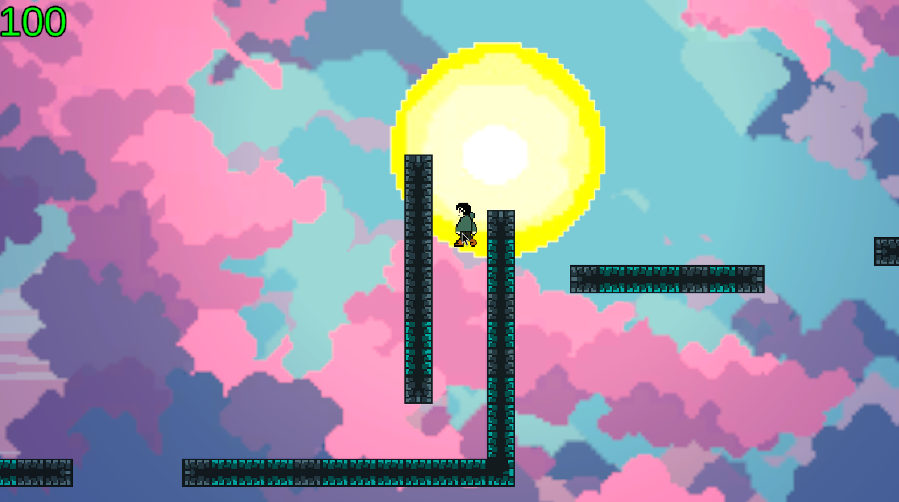
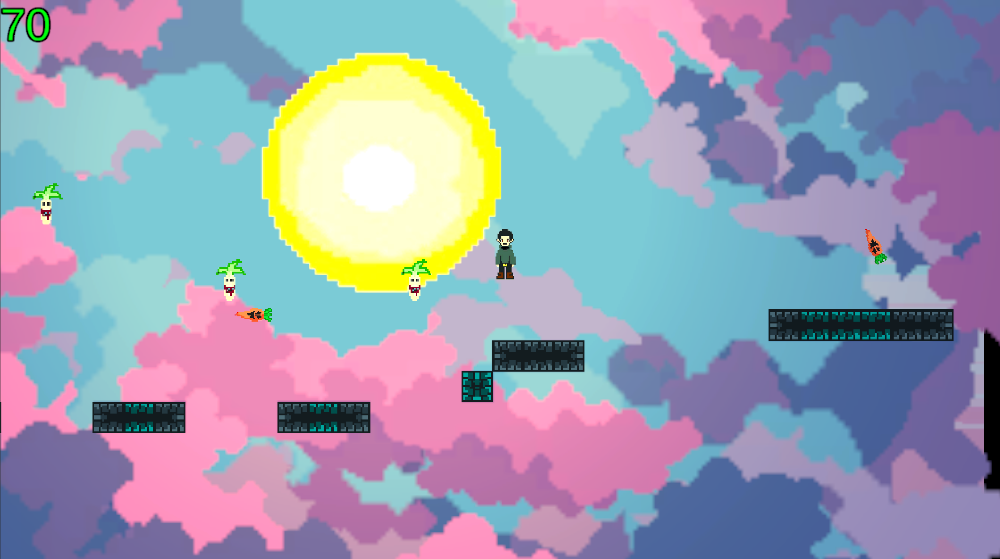
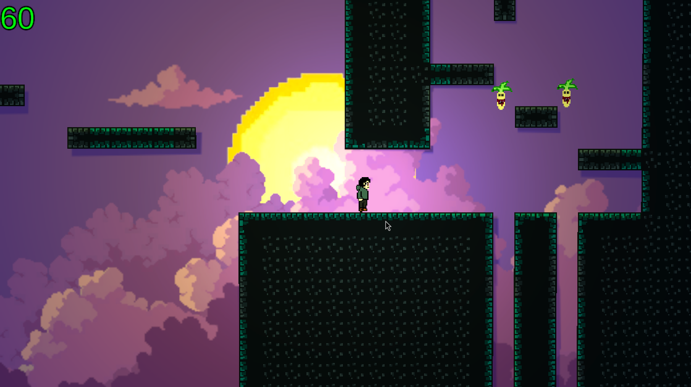
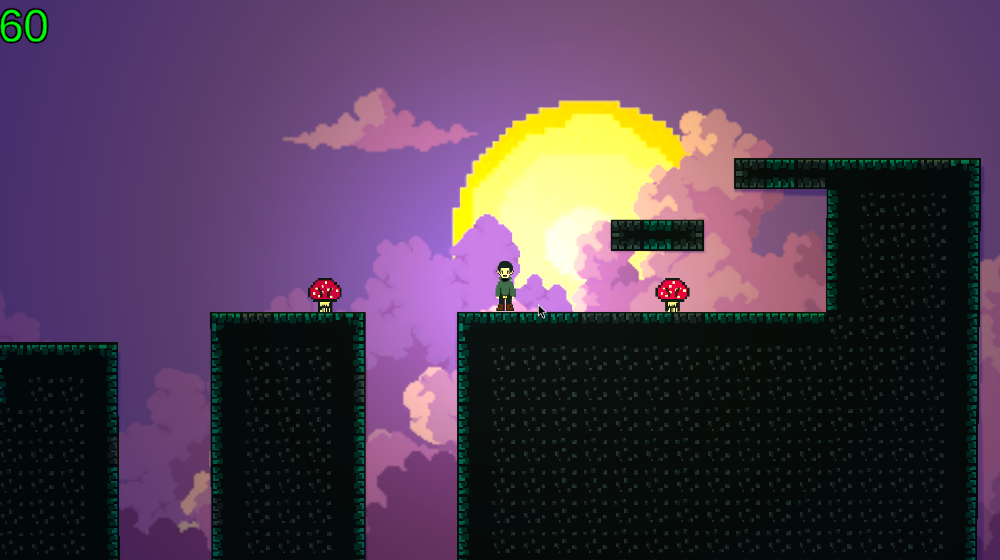

# Snack Attack

Snack Attack is a small 2D platformer game built with Unity and it was originally created during a **3-day game jam** by our team.

At the time, we had limited experience with the engine. (Most of the team had never used Unity before.) And now we are keeping the project publicly available. We apologize for the fact that the game is full of bugs 😭.

## Screenshots









## Development Setup

- clone the project:
```bash
git clone https://github.com/BeeCrafters/Snack-Attack.git
cd Snack-Attack
```
- open the Project with Unity `6000.3.23f1 LTS` (Newer Unity 6 versions may be compatible, but the project is developed and tested with Unity 6000.3.23f1)
- load the scene you want, located in Assets/Scenes

### TODO

* [ ] Release build
* [ ] BETTER GAMEPLAY
* [ ] BUTTONS NOT WORKING?
* [ ] BETTER UI

## License

This project is licensed under the [MIT License](LICENSE).


